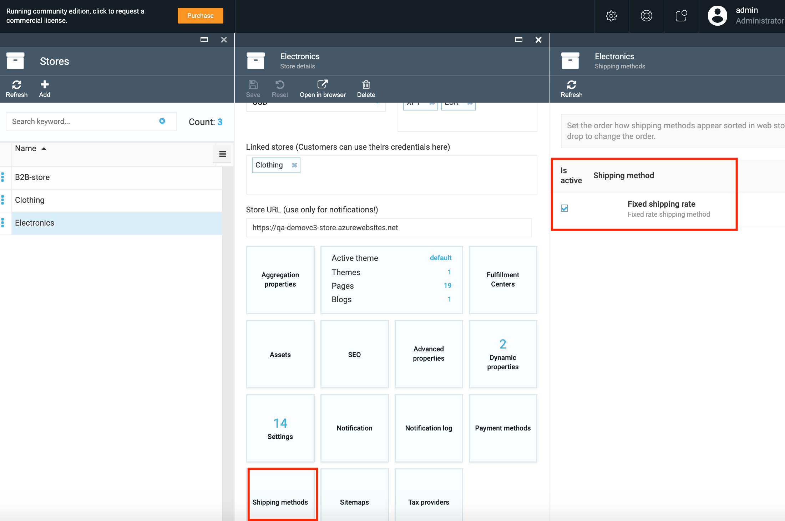
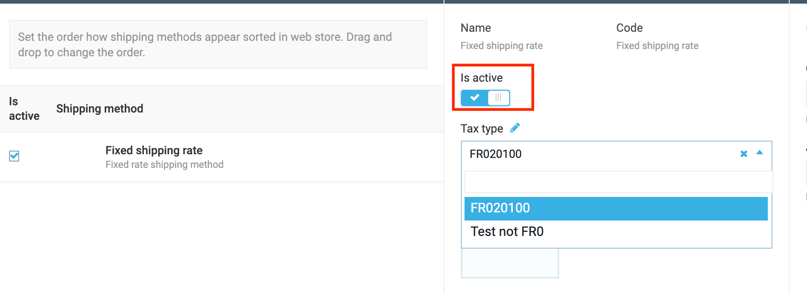
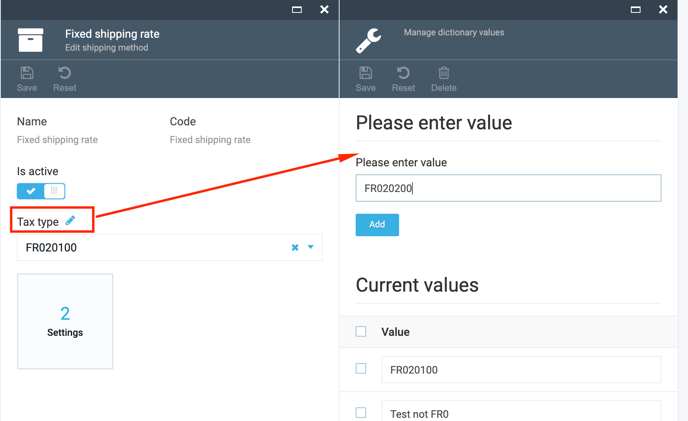
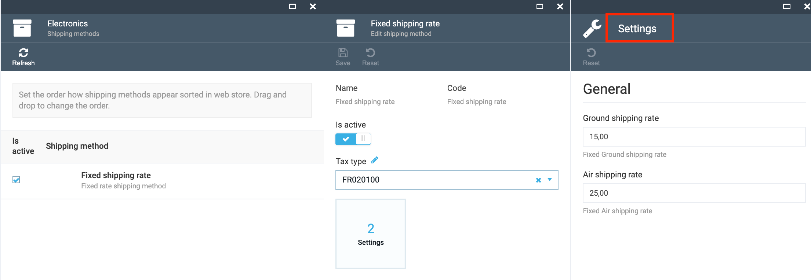

# Overview

The Shipping module allows the following:

1. Register shipping methods using the code;
1. Receive the list of Shipping methods on UI on admin side;
1. Edit shipping method settings;
1. Connect the shipping methods to a Store;
1. API to work with shipping method list.

The selected Shipping methods will be available for selection on the Storefront.

## Scenarios

### Select Shipping Method

1. Go to More->Store->select the Store;
1. In the opened Store details select the 'Shipping methods' widget;
1. The system will display the list of registered shipping methods;
1. Select the shipping methods that you want to be connected to the Store and displayed on the Storefront;
1. Save the changes made;
1. The selected shipping methods will be available for selection on the Storefront.

### Edit Shipping Method

1. Select the Shipping method on Shipping methods blade and click on it;
1. On the 'Edit shipping method' blade you can edit the following:

     1. Activate or de-activate the shipping method using the 'Is Active' button;
     1. Select the 'Tax type' from the drop down;
     1. Add a new Tax type if needed
1. Save the changes by clicking the 'Save' button;
1. The Shipping method will be edited.

### Add a Tax type to the list

1. On the 'Edit shipping method' blade click the 'Edit' icon next to the Tax type;
1. Enter the value and click 'Add';
1. Save the new Tax type;
1. The new Tax type will appear in the list and will be available for selection.

### Edit Settings

1. On the 'Edit shipping method' blade select the 'Settings' widget;
1. Specify the Ground shipping rate and the 'Air shipping rate';
1. Click 'OK';
1. Save the changes made;
1. The new rates will be displayed on the Storefront.

